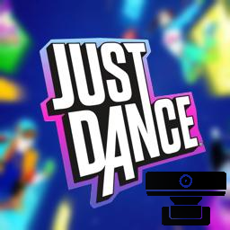

# Open Just Dance by @vincent-hsaalen and @skyline69

## Contents
1. [What is Open Just Dance?](#what-is-it)
2. [Ambition](#ambition)
2. [Requirements](#requirements)
3. [Setup / Usage](#setup)
4. [Work In Progress](#work)

## What is Open Just Dance

Open Just Dance is a project to create a free and open source "Just Dance" experience. It is currently in development and is not yet playable. Microsoft's decision to stop supporting the Kinect plattform led to Ubisoft (publisher and developer of the Just Dance Series) no longer developing for previous generation consoles.

## Ambition
Beginning with Just Dance 2023, body tracking is no longer done with Kinect, instead smartphones or JoyCon's are used to estimate your hand position.
This project aims to bring back the Kinect experience by comparing the choreography of the song to poses captured by your webcam using [openpose](https://github.com/CMU-Perceptual-Computing-Lab/openpose/).

## Requirements
- [openpose - windows portable demo](https://github.com/CMU-Perceptual-Computing-Lab/openpose/blob/master/doc/installation/0_index.md#windows-portable-demo)

## Setup / Usage
1. Download the [openpose - windows portable demo](https://github.com/CMU-Perceptual-Computing-Lab/openpose/blob/master/doc/installation/0_index.md#windows-portable-demo)
2. 
3. 

## in development / work in progress

> literally anything, but here are some ideas:

- scoring system
- user interface
- multiple player support
- song selection -> more songs / choreographies
